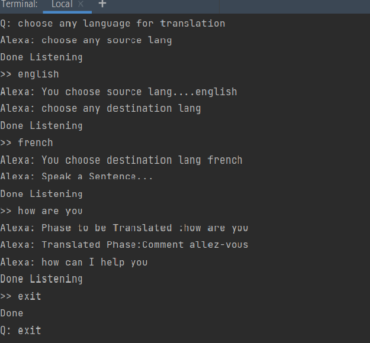

# Language Translator and Speech Recognition in Python using Google APIs

## About Project?  
> we are going to implement a Language Translator and Speech Recognition in Python using Google APIs. 
> We will be using a special type of library that is googletrans,SpeechRecognition,pyaudio library of Python
> The app will capture audio input and stream it to Speech to Text service. As the input speech is recognized by SpeechRecognition transcribed, it will also be sent to a Googletranslator Translator service to be translated into the language you select.
> Both the transcribed and translated text will be displayed by the app in real time. Each completed phrase will be sent to gTTS (Google Text-to-Speech), a Python library and CLI tool to interface with Google Translate text-to-speech API.
> we are going to build a API in which you can Speek the sentence and recognize it straight away using SpeechRecognition library.
> Text to Speech to be spoken in your choice of locale-specific voices.Also
> Also,In the project according to the particulare speech query the matching task is perfomed by the API.
## Google APIs
> Google APIs are application programming interfaces (APIs) developed by Google which allow communication with Google Services and their integration to other services. 
> Examples of these include Search, Gmail, Translate or Google Maps. 
> Third-party apps can use these APIs to take advantage of or extend the functionality of the existing services.
> The APIs provide functionality like analytics, machine learning as a service (the Prediction API) or access to user data (when permission to read the data is given).
> Another important example is an embedded Google map on a website, which can be achieved using the Static Maps API, Places  or Google Earth API.
## 
## Speech Recognition
> Speech Recognition is an important feature in several applications used such as home automation, artificial intelligence, etc.
> This article aims to provide an introduction on how to make use of the SpeechRecognition library of Python.
> This is useful as it can be used on microcontrollers such as Raspberri Pis with the help of an external microphone.
## Translation API
> Googletrans is an open-sourced Python library that implements Google Translate API. It is very fast and liable and it actually uses the same server as used by translate.google.com. 
> Googletrans has the feature of auto language detection hence the language of the input text needs not to be specified.
> The Translation API provides a simple, programmatic interface for dynamically translating an arbitrary string into any supported language using state-of-the-art Neural Machine Translation.
> It can also be used to detect a language in cases where the source language is unknown.
## Prerequisites  
> The interesting Python project requires you to have basic knowledge of Python programming, and library that is  googletrans,SpeechRecognition,pyaudio library of Python.
> You’ll need to install the following libraries with pip:

```sh
pip install googletrans
pip install SpeechRecognition
pip install playsound
pip install gTTS
py -m pip install pyautogui
pip install pyttsx3
pip install pyaudio
```


## Libraries Required

- googletrans 
- SpeechRecognition 
- playsound
- pyaudio
- gTTS
- pyautogui
- pyttsx3

## Tech


- Django- Django is a high-level Python Web framework that encourages rapid development and clean, pragmatic design.
- Python - Importing the necessary libraries-


## Development

Pycharm uses for fast developing.
Make a change in your file and instantaneously see your updates!

## Execution 

Open your favorite Terminal and run the commands.


```sh
python asis_google_api.py
```


## _ScreenShots_



